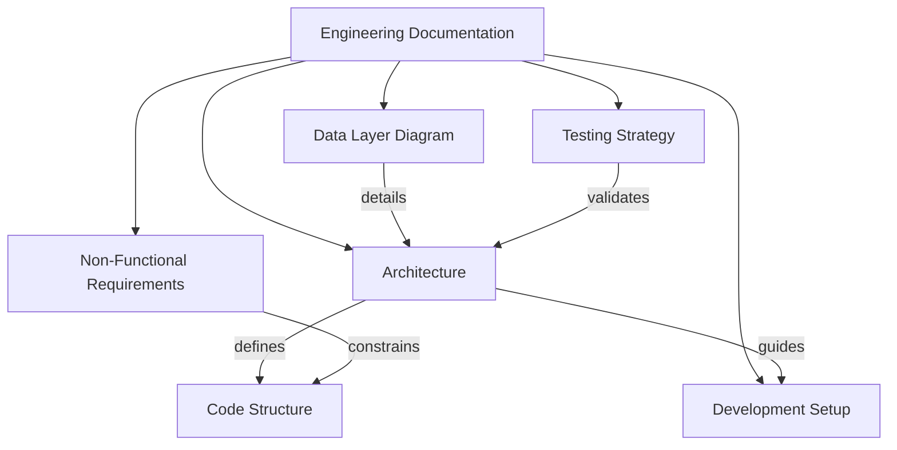

# Engineering Documentation - BeatRecall

## 🔧 Overview

This directory contains technical documentation - **how** we're building the product. This is the primary reference for Developers, QA Engineers, and DevOps working on the codebase.

---

## 📚 Documents

### 1. [Architecture Documentation](architecture/architecture.md)
**Purpose:** Technical architecture and design patterns

**Contents:**
- Layered architecture overview (Presentation, Service, Domain, Data)
- Layer responsibilities and interactions
- Data flow examples
- State management strategy (Provider/Riverpod)
- Code structure and organization

**Use this when:** You need to understand how the app is structured and how components interact.

---

### 2. [Data Layer Architecture Diagram](architecture/data_layer_diagram.md)
**Purpose:** Visual diagrams of data layer implementation with UUID-based domain/data separation

**Contents:**
- Component overview (Mermaid class diagram)
- Data flow diagrams (save, find operations)
- Index strategy and query performance
- Benefits of clean architecture approach

**Use this when:** You need to understand data persistence, entity mapping, or repository implementation.

---

### 3. [Development Setup Guide](setup/development_setup.md)
**Purpose:** Complete guide to setting up the development environment

**Contents:**
- Prerequisites and required software
- Environment setup (Flutter, IDE, platforms)
- Project structure
- Database setup (Isar)
- YouTube integration
- Development workflow (branching, testing, building)
- Troubleshooting common issues

**Use this when:** You're setting up your development environment or onboarding new developers.

---

### 4. [Testing Strategy](testing/testing_strategy.md)
**Purpose:** Comprehensive testing approach and guidelines

**Contents:**
- Testing pyramid and goals (70% unit, 20% integration, 10% E2E)
- Unit testing guidelines and examples
- Widget testing approaches
- Integration testing flows
- Test automation (CI/CD)
- Test data management

**Use this when:** You're writing tests or setting up testing infrastructure.

---

### 5. [Non-Functional Requirements](non_functional/non_functional_requirements.md)
**Purpose:** Quality attributes and technical constraints

**Contents:**
- Performance requirements (startup time, query speed, FPS)
- Reliability and availability targets
- Usability and accessibility requirements
- Compatibility (platforms, devices, OS versions)
- Security and privacy constraints
- Maintainability standards (code quality, coverage)

**Use this when:** You need to ensure the app meets quality standards and constraints.

---

## 🚀 Quick Start

### For New Developers:
1. **First**, follow [Development Setup Guide](setup/development_setup.md) to configure your environment
2. **Then**, study [Architecture Documentation](architecture/architecture.md) to understand code structure
3. **Review** [Data Layer Architecture Diagram](architecture/data_layer_diagram.md) for database implementation details
4. **Next**, review [Testing Strategy](testing/testing_strategy.md) for quality standards
5. **Finally**, check [Non-Functional Requirements](non_functional/non_functional_requirements.md) for constraints

### For QA/Testers:
1. **Testing Strategy** for test approach and coverage goals
2. **Non-Functional Requirements** for performance metrics
3. **Architecture** to understand test boundaries
4. See [Product Documentation](../product/README.md) for acceptance criteria

---

## 📖 Document Relationships

---

## ✅ How to Use These Documents

### During Development:
- Reference **Architecture** for code organization
- Follow **Development Setup** for environment issues
- Use **Testing Strategy** for writing tests
- Validate against **Non-Functional Requirements** for quality

### During Code Review:
- Check compliance with **Architecture** patterns
- Verify **Testing Strategy** coverage requirements
- Ensure **Non-Functional Requirements** are met (performance, security)

### During Release:
- Validate all **Non-Functional Requirements** acceptance criteria
- Confirm **Testing Strategy** coverage goals achieved
- Verify **Development Setup** documentation is current

---

## 🛠️ Key Technical Decisions

### Tech Stack:
- **Framework:** Flutter 3.0+
- **Language:** Dart
- **Database:** Isar (NoSQL local storage)
- **Media:** YouTube Player Flutter
- **State Management:** Provider (MVP), Riverpod (future)
- **Architecture:** Layered (Presentation → Service → Domain → Data)

### Quality Standards:
- **Code Coverage:** 70% minimum, 90% for business logic
- **Performance:** < 2s startup, < 100ms queries, 60 FPS animations
- **Platforms:** Android 6.0+, iOS 12.0+
- **Testing:** Follow testing pyramid (70/20/10)

---

## 🔗 Related Documentation

For product requirements and user stories, see [Product Documentation](../product/README.md).

---

*Last updated: 2026-02-07*  
*Maintained by: BeatRecall Engineering Team*
