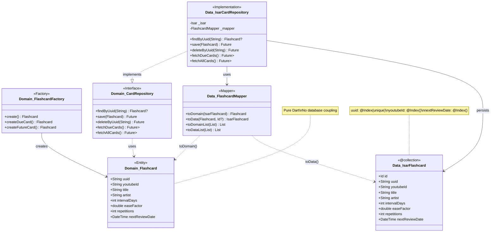

# Data Layer Architecture Diagram

## Component Overview


## Data Flow: Save Operation


## Data Flow: Find Operation


## Index Strategy

### IsarFlashcard Indexes

| Field | Index Type | Purpose |
|-------|-----------|----------|
| `uuid` | **unique** | Primary lookup from domain layer |
| `youtubeId` | standard | Duplicate detection |
| `nextReviewDate` | standard | Due card queries (sorted) |

### Query Performance

- **findByUuid()**: O(log n) via unique index
- **existsByYoutubeId()**: O(log n) via index
- **fetchDueCards()**: O(k) via sorted index (k = due count)

## Benefits of This Architecture

### ✅ Domain Independence
Domain has no Isar imports/annotations - pure Dart entities

### ✅ Testability
Domain logic testable without database - use factory for test data

### ✅ Flexibility
Can swap Isar for SQLite/Hive without domain layer changes

### ✅ Stability
UUID references remain valid across database implementations

### ✅ Performance
Still benefits from Isar's auto-increment ID internally for optimal queries


## Benefits of This Architecture

```
┌──────────────────────────────────────────────────────────┐
│ ✅ Domain Independence                                   │
│    Domain has no Isar imports/annotations                │
├──────────────────────────────────────────────────────────┤
│ ✅ Testability                                           │
│    Domain logic testable without database                │
├──────────────────────────────────────────────────────────┤
│ ✅ Flexibility                                           │
│    Can swap Isar for SQLite/Hive without domain changes  │
├──────────────────────────────────────────────────────────┤
│ ✅ Stability                                             │
│    UUID references remain valid across DB implementations │
├──────────────────────────────────────────────────────────┤
│ ✅ Performance                                           │
│    Still benefits from Isar's auto-increment ID internally│
└──────────────────────────────────────────────────────────┘
```
